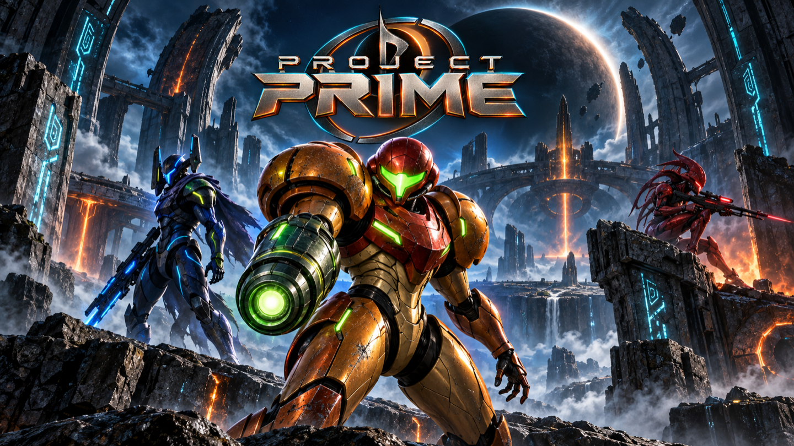

# Prime Hunters



**Metroid Prime Hunters on PC and Android.** Online matches for up to 8 players, widescreen, 60 FPS,
and a launcher that does the setting up for you.

A fork of [NoneGiven/MphRead](https://github.com/NoneGiven/MphRead).

> You bring your own Metroid Prime Hunters cartridge dump. No Nintendo game data ships here or is
> downloaded.

**[Download](https://github.com/liveteklol/Fruity-Prime/releases)** · [Support the project ☕](https://ko-fi.com/livetek)

## Features

- **Ultra Widescreen support**
- **High resolution**
- **Windows / Linux / Android port**
- **240+ FPS support**
- **Online multiplayer** (no WFC support)
- **Up to 8 players**
- **Dedicated Node + Worker servers**
- **Demo recording**
- **Custom maps**
- **12 multiplayer modes**: Battle, Survival, Capture, Bounty, Defender, Nodes, Prime Hunter, and teams
- **Keyboard & mouse**
- **Cel shading**
- **Modern HUD**
- **Auto Update check**

## Support

If you enjoy it: **[ko-fi.com/livetek](https://ko-fi.com/livetek)** ☕


## Getting started

1. **[Download](https://github.com/liveteklol/Fruity-Prime/releases)** the package for your system
   and unzip it.
2. Run it:
   - **Windows** — double-click `FruityPrime.exe`
   - **Linux** — `./FruityPrime -launcher`
   - **macOS** — `xattr -dr com.apple.quarantine .` once, then the same as Linux
3. Click **Game files** and pick your `.nds`. It unpacks itself, once, with a progress bar.
4. Play.

`Escape` opens the menu, `F11` is fullscreen. Your name, hunter, controls and HUD are in
**Settings**, in the launcher or from that menu.

## Playing with other people

| | |
|---|---|
| **Join** | **Join**, sign in, choose a compatible public Node, then choose a listed public lobby |
| **Host** | **Host**, choose a public Node, create a public lobby, configure the match and start it |
| **Self-host** | Run the combined Node + Worker package, publish its HTTPS/WSS endpoint, and have players join its public lobby |

Everybody in a match needs the same version; the launcher checks for a new one and says so.

Online matches use a persistent Server Node for account-backed control, sessions, public lobbies and
match placement. A managed Worker owns each match's 60 Hz authoritative simulation and receives
gameplay UDP directly from clients; the Node connection remains the reliable control path. The client
cutover exposes public lobbies only. Private or unlisted local hosting has been retired, and there is
no direct Worker `--standalone` mode. Servers need extracted game data or a compact baked package;
see the [implementation and validation notes](docs/NETWORK_MODERNIZATION.md) and the
[Server Node guide](src/Server.Node/README.md).

## Custom maps

A map is one file: `something.fpmap`. Put it in the `maps` folder beside the game and it is in the
map list next time you open the launcher, picture and all. **de_dust2** comes with it.

## Not done yet

- **Gamepads**, on any platform.

## Command line

The `-room` and `-model` options still open the multiplayer room and model asset viewer. The old
local-gameplay path no longer accepts `-mode` and `-players`; use `-launcher` to join or host a
multiplayer match.

## Building

For a complete deployable build, use:

```bash
./build-all.sh
```

This cooks all custom map bundles once, then compiles, publishes, and validates
desktop clients for `win-x64`, `linux-x64`, `osx-x64`, and
`osx-arm64`; release server bundles for `win-x64`, `linux-x64`, and
`linux-arm64`; a clearly marked local/development `osx-arm64` server; and an
Android APK. Android needs the .NET Android workload plus a JDK and Android SDK;
use `./build-all.sh --skip-android` when intentionally building desktop/server
artifacts only. `--version VERSION` stamps the artifacts and `--output DIR`
selects the final directory. The default is a timestamped directory beneath
ignored `publish/`. A failed build never replaces that final directory and
preserves its partial staging directory with an `.incomplete` name for diagnosis.

The output carries custom `.fpmap` bundles, not proprietary game content.
AMHE1-derived room binaries are prepared at runtime from each operator's own
extracted content and are explicitly not shipped.

The lower-level equivalents are:

```bash
dotnet run --project src/Tools/Tools.csproj -c Release -- \
  -mapdir maps -mapbundle all
dotnet publish src/Client/Client.csproj -c Release \
  -r win-x64|linux-x64|osx-x64|osx-arm64 --self-contained true -p:PublishSingleFile=true
```

Needs [.NET 10.0](https://dotnet.microsoft.com/en-us/download/dotnet/10.0).
The bundle step puts every custom map's recipe, level and baked textures into
the `.fpmap` files copied into client and server packages. `Client.csproj` also
runs this cook and copies newly created bundles during a direct publish. The
client and the packaged Worker build missing derived room binaries in the
operator's extracted `AMHE1` directory before Node discovery, so use the same
content version and map bundles on both sides. The development launchers run
the Worker preparation step before generating Node configuration for extracted
content; it is incremental, serialized per canonical content path, and requires
that directory to be writable. When `server-content.json` is present, the
launchers use the baked catalog directly and skip preparation, so baked server
content packages can remain read-only.
`tools/package-server.sh` runs the map-bundle cook for direct server packaging
as well.
`tools/package-server.sh --rid linux-x64 --output publish/server-linux-x64` packages the Backend,
persistent Server Node, and its bundled Worker; use `win-x64` or `linux-arm64` for the other supported
server targets. Android is `dotnet build src/Android/Android.csproj` with the `android` workload. Every command
line option, and the test harness, are in [`CLAUDE.md`](CLAUDE.md).

Linux bundles include `start-dev.sh` for running the packaged Node and Worker
against a shared development Backend, and `start-stack-dev.sh` for starting the
bundled Backend, Node, and Workers together. The repository-root `start-dev.sh`
does the same all-in-one development start and generates development credentials.
These development launchers advertise the Node on HTTPS/WSS port `8443` by
default, which is suitable for a Cloudflare-proxied hostname without requiring
root; set `PRIME_NODE_BIND` and `PRIME_NODE_PUBLIC_CONTROL_URI` to use another
port.
All paths need external AMHE1 content; the shared-Backend path also needs its
provisioned Node ID, Backend ticket public key, and directory credential.

For the easiest repository start or restart, put extracted `AMHE1` at the
repository root (or pass `--content-dir`) and run:

```bash
./start-server.sh
./start-server.sh --status
./start-server.sh --stop-only
```

The command safely stops only the stack verified against its state-directory
lock and supervisor metadata, then starts the Backend, Node, and Node-managed
Workers. Logs and generated credentials live in
`${PRIME_DEV_STATE_DIR:-${TMPDIR:-/tmp}/project-prime-dev}`. Use `--state-dir`
to select another state directory and `--grace-seconds` to change the overall
restart wait (default 60 seconds). A forced stop can interrupt active matches;
the supervisor allows the Node up to 45 seconds to drain, then stops the Backend.

Build the desktop solution with `dotnet build Game.sln`; Android remains a separate
workload build. The [project layout](docs/PROJECT_LAYOUT.md) describes the Game,
Client, Server Node, Server Worker, Tools and Android boundaries. Client output no longer
contains a local server executable; hosting is provided by the Backend + Node + Worker package.

## Credits

Prime Hunters (formerly Fruity Prime) is Livetek's fork of [MphRead](https://github.com/NoneGiven/MphRead) by **NoneGiven** —
the model viewer, the renderer, the format parsers and the recreation of the game itself are theirs.
That work is in turn built on **dsgraph**, [Chemical](https://gitlab.com/ch-mcl/metroid-prime-hunters-file-document),
[McKay42](https://github.com/McKay42), [Barubary](https://github.com/Barubary/dsdecmp),
[loveemu](https://github.com/loveemu/loveemu-lab), **Gericom**,
[CharlesVanEeckhout](https://github.com/CharlesVanEeckhout/actimagine),
[CyberBotX](https://github.com/CyberBotX/NCSF) and
[hackyourlife](https://github.com/hackyourlife/mph-viewer), with
[OpenTK](https://github.com/opentk/opentk), [OpenAL Soft](https://github.com/kcat/openal-soft) and
[SoundFlow](https://github.com/LSXPrime/SoundFlow) underneath. `FruityPrime -credits` prints the
list with what each one is for, and the Settings screen shows it too.

Metroid Prime Hunters is Nintendo's. No game data is included with this program: it comes from your
own cartridge dump.
