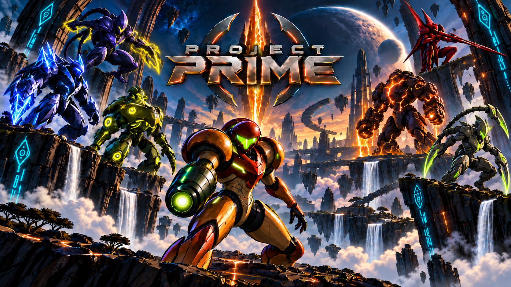

# Project Prime



**A multiplayer-focused rebuild of Metroid Prime Hunters for modern desktop and Android systems.**

Project Prime combines the original Hunters gameplay and assets from your own cartridge dump with a
modern launcher, authoritative online multiplayer, high-resolution rendering, replays, custom maps,
and dedicated server infrastructure.

> [!IMPORTANT]
> Project Prime does not include, host, or download Nintendo game data. You must provide your own
> Metroid Prime Hunters `.nds` cartridge dump. Derived room data is prepared locally and is never
> included in release or server packages.

**[Download releases](https://github.com/AntiNotAnti/Project-Prime-Releases/releases)** ·
**[Source code](https://github.com/AntiNotAnti/Project-Prime)** ·
**[Support the project](https://ko-fi.com/tterraj)**

Project Prime is based on [NoneGiven/MphRead](https://github.com/NoneGiven/MphRead). It is multiplayer
only; the original campaign is outside the current runtime scope.

## Highlights

### Gameplay

- Up to **8 players**, plus configurable bots and observer seats.
- All **12 Hunters multiplayer modes**:
  - Battle
  - Team Battle
  - Survival
  - Team Survival
  - Capture
  - Bounty
  - Team Bounty
  - Nodes
  - Team Nodes
  - Defender
  - Team Defender
  - Prime Hunter
- Server-authoritative, fixed **60 Hz** simulation with isolated match state and deterministic RNG.
- Configurable match rules, teams, readiness, bots, waitlists, spectators, and tournament control.
- Modern combat feedback, HUD, radar, score presentation, awards, overtime, and post-match results.

### Online play

- A persistent launcher and control session across lobby, match, results, and the next round.
- Account sign-in or an explicitly selected guest session; guest access is never an automatic fallback.
- **Quick Play**, **Browse Lobbies**, and **Host Lobby** entry paths.
- Public lobbies with chat, ready state, map/mode configuration, player and observer seats, and recovery
  after Worker failure.
- Direct authenticated UDP gameplay with reliable Node control traffic kept separate.
- Session resume and match rejoin with a bounded **45-second** server grace period.
- Post-match voting for rematch, next map, another compatible map, or return to lobby.
- Protocol **16**, including authenticated datagrams, quantized radial controller movement, and an
  authoritative Spire alternate-form attack presentation flag.

### Presentation and input

- High-resolution and ultra-wide rendering with cel shading and modern presentation options.
- SDL 3 GPU desktop renderer with Direct3D, Vulkan, or Metal selected by the platform/runtime.
- Original, Enhanced, and Performance graphics presets, plus filtering, anisotropy, MSAA, bloom, and
  lighting controls.
- Configurable presentation-rate caps for high-refresh displays while gameplay simulation remains at
  60 Hz.
- Keyboard and mouse, gamepad buttons/sticks/triggers, gyro-capable controller processing, and Android
  touch input paths.
- Replay recording and Theatre playback, highlights, killcams, spectator cameras, and broadcast tools.
- Signed update manifests and transactional desktop update staging at safe restart points.

### Maps and creator tools

- Installable, portable `.fpmap` v2 bundles with stable identity and exact content verification.
- Content-addressed build cache and automatic acquisition of missing server-required maps.
- Bundled **Project Prime Editor** in every desktop package.
- Create and edit native maps, import Quake III BSP/PK3 content, manage materials and entities, preview
  maps, and use bounded undo/redo history.
- Android can install and play `.fpmap` bundles; map editing remains desktop-only.
- The repository ships Project Prime map bundles such as DUST2, PARALLAX, and the test arena without
  shipping proprietary game content.

## Supported packages

| Package | Targets | Notes |
|---|---|---|
| Desktop client + editor | Windows x64, Linux x64, macOS x64, macOS Apple Silicon | Self-contained .NET applications; Windows x64 requires the Microsoft Visual C++ v14 x64 Redistributable |
| Android client | Android ARM64 and x64 | Targets Android API 36; minimum supported API is 24 |
| Release server | Windows x64, Linux x64, Linux ARM64 | Backend + persistent Node + managed Worker pool |
| Local development server | macOS Apple Silicon | Intended for development, not a public release server |

The current automated build matrix covers these packages. Physical-device, high-refresh, controller,
touch, audio, protected-binary, deployed PostgreSQL, and geographic-WAN acceptance are tracked
separately and must not be inferred from build success; see [Current status](#current-status).

## Getting started

1. Download the package for your system from
   [Project Prime Releases](https://github.com/AntiNotAnti/Project-Prime-Releases/releases).
2. Extract the complete archive to a writable directory.
3. Start the launcher:
   - **Windows:** run `ProjectPrime.exe`.
   - **Linux:** run `./ProjectPrime -launcher`.
   - **macOS:** if Gatekeeper quarantined the extracted package, run
     `xattr -dr com.apple.quarantine /path/to/ProjectPrime`, then run `./ProjectPrime -launcher`.
4. In **Settings → Game files**, select your own Metroid Prime Hunters `.nds` dump. The launcher
   extracts and prepares it once with visible progress. Supported whole-image identities and the
   evidence boundary are documented in [Supported cartridge identities](docs/CARTRIDGE_IDENTITIES.md).
5. Sign in or explicitly choose guest access, then open **Play**.

The main shell includes **Play**, **Maps**, **Hunter**, **Rankings**, **Theatre**, and **Settings**.
Account-backed Hunter pages expose license, career, recent-match, rating, and ranking information;
guest sessions can play but do not own account progression.

During a match, `Escape` opens the pause menu, `F11` toggles fullscreen, and `F10` or
`Ctrl/Cmd+R` saves the latest ten seconds from the rolling replay buffer. Controls, controller
response, touch layout, graphics, audio, HUD, radar, network diagnostics, and accessibility options are
managed from Settings.

You can also open a `.fpmap` file with the Project Prime executable to install it before entering the
launcher.

## Playing online

Choose one of the three Play actions:

| Action | Behavior |
|---|---|
| **Quick Play** | Selects a compatible public Node and joins an open lobby; repeated listing races fall back to Browse. |
| **Browse Lobbies** | Shows bounded, paged public lobby listings and their map, mode, occupancy, bots, observers, and availability. |
| **Host Lobby** | Creates a public lobby on the selected Node, then lets the owner configure the supported map, mode, rules, seats, and bots. |

When a round ends, the final scene remains behind the Results view while the Node runs the next-round
ballot. A compatible result can continue directly into a rematch or new map without tearing down the
launcher or persistent Node session. Interrupted matches reopen the lobby instead of inventing a
result.

All players need compatible build, content, and protocol identities. Live protocol admission is
exact: peers using a different protocol cannot join until their build matches the current live
reference.

For the complete state and ownership contract, read the
[seamless online lifecycle](docs/SEAMLESS_ONLINE_FLOW.md) and
[current protocol reference](docs/CURRENT_PROTOCOL.md).

## Custom maps

The launcher treats each custom map as one portable `.fpmap` file:

1. Open **Maps** to inspect installed, available, missing, or incompatible content.
2. Install a local `.fpmap`, or let online admission acquire the exact required artifact from an
   authorized source.
3. On desktop, open **Maps → My Maps** to create, import, edit, build, and preview a map project with
   the bundled editor.
4. Host or join a lobby only after the local and server catalogs agree on the exact map identity.

Downloads are resumable and an unverified partial is never installed. A Worker retains immutable
prepared metadata and creates a separate content snapshot for every match, so two matches cannot
mutate each other's map state.

See [maps/README.md](maps/README.md) for authoring examples and
[Map platform stabilization](docs/MAP_PLATFORM_STABILIZATION.md) for the current format, cache,
editor, and runtime contracts.

## Self-hosting

Project Prime uses one deployable server stack:

```text
Backend
  |
Persistent Server Node
  |-- sessions, lobbies, chat, readiness, handoff, administration
  |
Managed Worker pool
  |-- MatchInstance A: isolated 60 Hz simulation + gameplay UDP
  |-- MatchInstance B: isolated 60 Hz simulation + gameplay UDP
  `-- MatchInstance N: isolated 60 Hz simulation + gameplay UDP
```

The Node owns the control plane. Workers own authoritative gameplay, and every `MatchInstance` owns
all of its mutable state, queues, RNG, and resources. Clients never launch a Worker, gameplay is not
tunneled through the Node connection, and there is no supported standalone-Worker hosting mode.

For a local repository stack, place extracted `AMHE1` content at the repository root or pass an
explicit content directory:

```bash
./start-server.sh
./start-server.sh --content-dir /absolute/path/to/AMHE1
./start-server.sh --status
./start-server.sh --stop-only
```

The supervisor starts the Backend, Node, and Node-managed Workers together. It only stops processes
whose identity and state-directory ownership it can verify. Generated development credentials and
logs live under the selected state directory (by default, a Project Prime directory beneath the system
temporary directory).

For a packaged or public deployment, start with:

```bash
tools/package-server.sh --rid linux-x64 --output publish/server-linux-x64
./deploy-server.sh --help
```

The deployment path is transactional and deploys the full Backend + Node + Worker stack. PostgreSQL
is a control-plane dependency; database or network I/O must never block a Worker's authoritative
simulation loop. Normal deployment requires the existing Backend to be ready. If an explicitly
applied forward database migration makes the prior Backend live but unready, use
`./deploy-server.sh --recover-forward-schema` once. That mode still requires a healthy Node, validates
the candidate Backend against the database before downtime, and requires the new Backend to become
ready; it does not permit a dead prior stack or bypass candidate validation. Operators should read
[SERVER.md](SERVER.md), the
[Server Node guide](src/Server.Node/README.md), and the
[rendered/WAN operator runbook](docs/RENDERED_WAN_OPERATOR_RUNBOOK.md) before publishing a Node.

## Building from source

### Requirements

- Git
- [.NET SDK 10.x](https://dotnet.microsoft.com/download/dotnet/10.0)
- On Windows x64: the current [Microsoft Visual C++ v14 x64 Redistributable](https://learn.microsoft.com/en-us/cpp/windows/latest-supported-vc-redist?view=msvc-170) for the packaged SDL, OpenAL, and miniaudio libraries
- Your own extracted `AMHE1` content for content-backed builds and tests
- For Android: the .NET Android workload, a JDK, and Android SDK/API 36 tooling

Clone and build the desktop/server solution:

```bash
git clone https://github.com/AntiNotAnti/Project-Prime.git
cd Project-Prime
dotnet build Game.sln -c Release
```

Android uses its separate target framework and workload:

```bash
dotnet workload install android
dotnet build src/Android/Android.csproj -c Release
```

### Complete artifact build

To cook maps once and produce every supported client, editor, server, and Android artifact in one
validated transaction:

```bash
./build-all.sh
```

Useful options:

```text
--version VERSION       stamp every package
--output DIRECTORY      choose the final artifact directory
--skip-android          intentionally omit Android dependencies and output
--no-client-protection  diagnostic builds only; not for public distribution
```

The script refuses to overwrite its final output, preserves failed staging output with an `.incomplete`
suffix for diagnosis, and validates map inclusion, proprietary-content exclusion, renderer packages,
client protection, executable subsystem type, APK integrity, and release manifests before publishing
the final directory.

Current complete-build targets are:

```text
Desktop client + editor: win-x64, linux-x64, osx-x64, osx-arm64
Release server:          win-x64, linux-x64, linux-arm64
Local/dev server:        osx-arm64
Android:                 ARM64 and x64 APK
```

### Focused development checks

```bash
dotnet build Game.sln -c Release

GAME_DATA_DIRECTORY="$PWD/AMHE1" \
  dotnet test tests/Tests/Tests.csproj -c Release

dotnet test tests/Server.Node.Tests/Server.Node.Tests.csproj -c Release \
  --filter 'RequiresGameContent!=true'

dotnet test tests/Backend.Tests/Backend.Tests.csproj -c Release
dotnet test tests/Imaging/Imaging.Tests.csproj -c Release

python3 -m unittest discover -s tools/tests
python3 tools/check-project-boundaries.py
python3 tools/check-multiplayer-only.py
```

PostgreSQL-backed Backend tests additionally require `PRIME_TEST_POSTGRES_FILE` to name a private
connection file. Do not place database credentials in the repository or command history.

The [project layout](docs/PROJECT_LAYOUT.md) explains the Game, Client, Backend, Server.Shared,
Server.Node, Server.Worker, Android, Tools, Editor, and test boundaries.

## Command-line tools

The client executable retains focused asset-inspection entry points:

```text
-room <multiplayer_room_name-or-id>
-model <model_name> [recolor_index]
-fh
-node
-entity
```

The retired local-gameplay `-mode` and `-players` path is not supported. Use the launcher for real
multiplayer. Asset extraction/export and map build commands live in `ProjectPrimeTools`.

## Current status

The authoritative working-tree references are:

- [Current architecture](docs/CURRENT_ARCHITECTURE.md)
- [Current protocol](docs/CURRENT_PROTOCOL.md)
- [Current release gates](docs/CURRENT_RELEASE_GATES.md)

The recorded **September 12, 2026** gate ledger includes a 2,664-test content-backed main
suite, 227 Server Node tests with real local Worker integration, 226 Backend tests with 7 PostgreSQL-only
tests skipped, 174 Python tool tests, successful Client/Game/Backend/Node/Worker builds, and zero project
boundary violations.

That is strong source, build, focused-test, and local integration evidence. It is not a claim of complete
physical Windows/macOS/Linux/Android acceptance, real controller/touch/audio ergonomics, high-refresh
performance across hardware, geographic WAN behavior, deployed PostgreSQL durability, protected
release launch, or symbol-recovery acceptance. Those gates remain open and are tracked explicitly in
the release ledger.

## Credits

Project Prime is a multiplayer-focused rebuild based on
[MphRead](https://github.com/NoneGiven/MphRead) by **NoneGiven**. The original model viewer, renderer,
format parsers, and game recreation established the foundation this project modernizes.

That work builds on contributions and research from **dsgraph**,
[Chemical](https://gitlab.com/ch-mcl/metroid-prime-hunters-file-document),
[McKay42](https://github.com/McKay42), [Barubary](https://github.com/Barubary/dsdecmp),
[loveemu](https://github.com/loveemu/loveemu-lab), **Gericom**,
[CharlesVanEeckhout](https://github.com/CharlesVanEeckhout/actimagine),
[CyberBotX](https://github.com/CyberBotX/NCSF), and
[hackyourlife](https://github.com/hackyourlife/mph-viewer), with projects including
[OpenTK](https://github.com/opentk/opentk), [OpenAL Soft](https://github.com/kcat/openal-soft), and
[SoundFlow](https://github.com/LSXPrime/SoundFlow) underneath. Run `ProjectPrime -credits` or open the
Settings credits page for the in-program attribution list.

LiveTek created the project this work grew from. FruityPrime is its predecessor and multiplayer
foundation.

Metroid Prime Hunters and all related Nintendo properties belong to Nintendo and their respective
owners. Project Prime is an independent fan project. No Nintendo game data is included; all game data
must come from the user's own cartridge dump.
