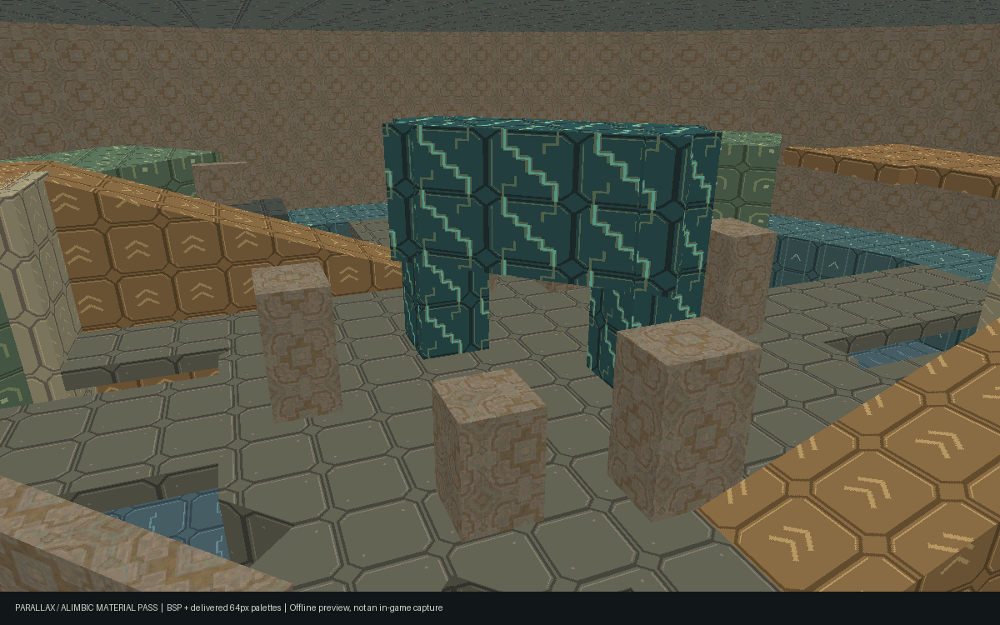
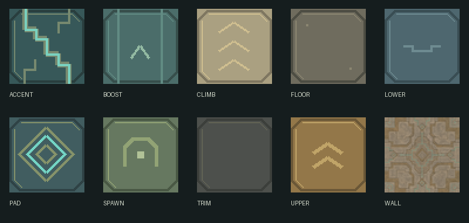

# Alimbic visual pass v0.2

The user approved the design audit and explicitly requested this visual pass.
Ten original 64×64 RGB materials replace the graybox grid. Architecture uses
muted carved stone and bronze, with restrained cyan reactor circuitry. Route
colors retain the graybox's readable distinctions; chevrons, arch and diamond
glyphs add shape cues. Artwork uses the repository's MIT license.



This is an offline software preview of the actual BSP and delivered BGR555
texture palettes, with approximate lighting. It is **not an in-game capture**.
The contact sheet below shows source tiles enlarged with nearest sampling.



## Reproduce

Use Python 3 with Pillow (authored and checked with Pillow 12.3.0):

```sh
python3 maps/parallax/source/art/build-materials.py
python3 maps/parallax/source/art/package-materials.py
python3 maps/parallax/source/validate.py
```

The first command mechanically converts the retained stone master and authors
nine geometric tiles from coordinates. The second uses `build.py --materials-only`
and the repository's existing `tools/bake-textures.py`, then writes the standard
three-entry ZIP bundle to `maps/PARALLAX.fpmap`. It retains the full BSP; the
normal game's `-mapbundle` cooker can trim unused lumps later. This path requires
no game installation and does not produce room binaries or thumbnails.

The material-only build checks SHA-256 of the source map, shader declarations,
BSP and recipe against `geometry-baseline.json`. It refuses changed geometry,
shader declarations or gameplay settings. Use the normal q3map2 build after such
edits; do not update these hashes merely to silence a mismatch. Material output
and ZIP packaging are deterministic. Do not change tile dimensions without
revisiting the BSP's compiled UV scale.

## Artwork provenance

`alimbic-stone.png` is the original output of the built-in imagegen tool. No
external API key, copied game texture or downloaded commercial asset was used.
The original remains in the tool's generated-image folder as well. Prompt:

> Create a seamless square tileable game environment texture, original ancient
> alien Alimbic-inspired carved masonry for a Nintendo DS-era sci-fi arena. Flat
> orthographic albedo texture only, absolutely no perspective, no scene, no
> objects, no text, no lettering, no border. Broad geometric sandstone-gray and
> muted bronze stone panels, stepped angular incised joints and a single
> restrained thin desaturated turquoise circuit motif. Medium light values,
> very low contrast subtle weathering, large simple graphic features readable
> when reduced to 64x64 pixels. Fourfold balanced composition. All edges
> seamlessly repeat. Surface evenly lit with no directional lighting or cast
> shadows. This is an original stone architectural material, not a copy of any
> existing game asset.

Only mechanical resizing and RGB/TGA conversion are applied to that master.
`build-materials.py` independently draws the other nine original materials;
they are code-authored geometric graphics, not modifications of the AI image.

## Verification and remaining gate

- Static BSP guardrails pass: 140 brushes, rotational symmetry, item economy,
  spawn and route clearance, cover, perimeter support and nominal pad arcs.
- BSP and recipe bytes remain identical to the pre-art inputs. Collision,
  geometry, UVs, entities, lighting, weapon economy and pad tuning are unchanged.
- Every used material has a valid 64×64 FPTX entry with in-range palette indices.
  Bundle recipe and all three payloads are checked against the authoritative inputs.
- Repeating authoring and packaging produces identical material, PK3 and bundle bytes.

Fresh room generation, engine rendering and multiplayer smoke testing were not
run: this session has no .NET SDK, q3map2, extracted MPH game files or working
Docker daemon. Earlier graybox runtime results do not certify the new material
pass. Once the runtime is restored, run the mapgen, renderprobe, thumbnail and
two-player smoke commands in the parent README, then replace the offline preview
with an in-game capture if desired. Human visibility and duel balance remain a
playtest gate; no geometry was changed in this pass to preempt those findings.
